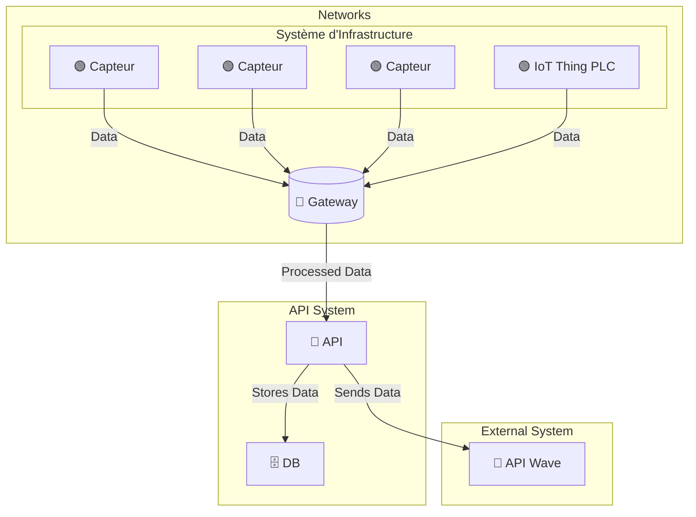
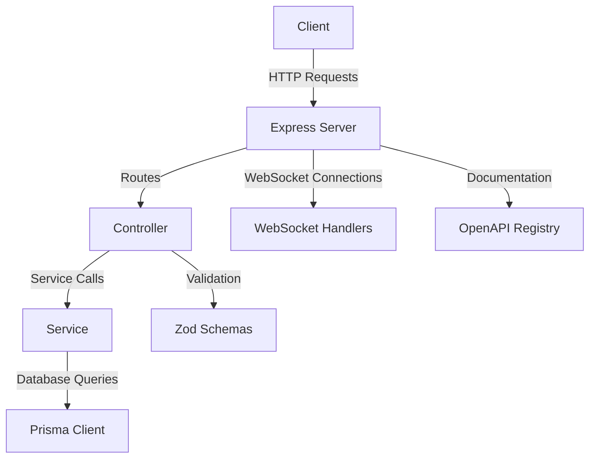

# IoT Vision

## User Guide

### How to Use

1. **Access Page**:
   - Navigate to the URL: `http://url/`.

2. **Setup and Run**:
   - Follow the installation steps below to set up and run the project locally.

## Context

### Component Interaction Diagram







## Installation

### Prerequisites

- Install [Node.js](https://nodejs.org/).
- Copy the project to a directory.

### Steps

1. **Install Dependencies**:
   ```bash
   npm install
   ```

   or 

  For production:

   ```bash
   npm i --omit=dev
   ```

2. **Set Up Environment Variables**:
   - Create a `.env` file in the root directory and configure it based on the `.env.Example` file provided.

3. **Run the Development Server**:
   ```bash
   npm run start
   ```

4. **Access the Page**:
   - Open your browser and navigate to `http://localhost:3000`.

## Developer Guide

### Project Structure

```
.
├── app
│   ├── api
│   │   ├── logger
│   │   │   ├── route.ts
│   │   │   ├── route.test.ts
│   ├── layout.tsx
│   ├── page.tsx
├── components
│   ├── ui
│   │   ├── ChartCanvas.tsx
│   │   ├── Query.tsx
│   │   ├── ViewToggle.tsx
├── config
│   ├── api.route.json
├── lib
│   ├── api.client.ts
│   ├── api.server.ts
│   ├── docs
│   │   ├── logger.ts
│   ├── model
│   │   ├── ReleverCapteurSearchParams.ts
│   │   ├── SiteHasCapteurSearchParams.ts
│   │   ├── index.ts
│   ├── transform.ts
│   ├── utils.ts
├── tests
│   ├── layout.spec.ts
│   ├── page.spec.ts
│   ├── queryForm.spec.ts
│   ├── viewtoggle.spec.ts
├── .env
├── .env.Example
├── jest.config.ts
├── package.json
├── playwright.config.ts
├── README.md
```

### Environment Variables

- **LOG_DIRECTORY**: Directory where logs are stored.
- **ENVIRONMENT**: Application environment (e.g., development, production).
- **API_BASE_URL**: Base URL for the API.
- **KEEP_LOGS_FOR**: Duration to keep logs (e.g., 90d for 90 days).
- **KEEP_LOGS_IN_PROD**: Whether to keep logs in production.
- **LOG_LEVEL**: Logging level (from lowest to highest: trace, debug, info, warn, error, crit, fatal).
- **DATE_PATTERNS**: Date pattern for log rotation.
- **DATE_FORMAT**: Date format for logs.
- **UNIX_FORMAT**: Whether to include Unix timestamp in logs.
- **LOG_TO_FILE**: Whether to log to files.
- **LOG_TO_CONSOLE**: Whether to log to console.

### Testing

- **Jest Tests**: All `.test.ts` files are Jest tests.
- **Playwright Tests**: All `.spec.ts` files are Playwright tests.

### Version Changes

- To change the version on the page, update the version in `package.json`.

### Key Points

- **Zod**: Ensures data integrity by validating request and response data.
- **Jest**: Ensures code quality with unit tests.
- **Playwright**: Ensures end-to-end testing.

### Scripts in `package.json`

- **dev**: Starts the development server with hot-reloading.
  ```bash
  npm run dev
  ```

- **build**: Builds the project for production.
  ```bash
  npm run build
  ```

- **start**: Starts the production server.
  ```bash
  npm run start
  ```

- **test**: Runs all tests using Jest.
  ```bash
  npm run test
  ```

- **test:watch**: Runs tests in watch mode.
  ```bash
  npm run test:watch
  ```

- **lint**: Lints the codebase.
  ```bash
  npm run lint
  ```

### Additional Documentation

- [Node.js Documentation](https://nodejs.org/en/docs/)
- [Jest Documentation](https://jestjs.io/docs/getting-started)
- [Playwright Documentation](https://playwright.dev/docs/intro)
- [Next.js Documentation](https://nextjs.org/docs)
- [Zod Documentation](https://zod.dev/)

By following this structure, the project maintains a clear separation of concerns, ensuring scalability and maintainability.
